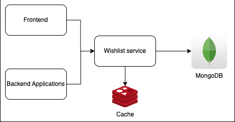
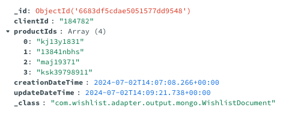
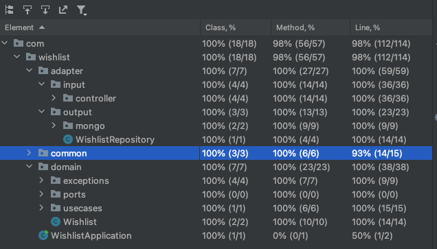

# Wishlist

O objetivo é que você desenvolva um serviço HTTP resolvendo a
funcionalidade de Wishlist do cliente. Esse serviço deve atender
os seguintes requisitos:
- Adicionar um produto na Wishlist do cliente;
- Remover um produto da Wishlist do cliente;
- Consultar todos os produtos da Wishlist do cliente;
- Consultar se um determinado produto está na Wishlist do cliente;

# Como rodar a aplicação

Criei um arquivo docker-compose.yml onde podemos subir o MongoDB e o Redis.

É necessário ter instalado o docker e o maven na máquina.

```
docker-compose up
```

Para rodar os testes e criar o jar:

```
mvn clean package
```

Para rodar o projeto spring boot:
```
mvn spring-boot:run
```

Incluí também o arquivo `run.sh` que pode ser executado, ele faz exatamente os comandos acima. Pode ser que tenha que dar permissões para rodar esse arquivo.
A primeira execução fazendo os downloads de todas as imagens pode levar um tempo.

# Endpoints 

Para acessar a documentação os endpoints rest, acesse esse link:
http://localhost:8080/swagger-ui/index.html#/

# Decisões

## Estrutura do projeto

Criei a estrutura do projeto baseado em arquitetura limpa e hexagonal.
Como é um projeto pequeno, não criei muitas camadas e uma estrutura complexa de diretórios.

```
-- adapter
     | -- input 
            | -- controller
     | -- output
            | -- mongo      
-- domain
     | -- usecases
     | -- ports
     | -- exceptions
```

Inicialmente, dividi entre adapter e domain.
No pacote Adapter estão todo código de entrada e saída de dados.
Os endpoints estão na camada do input e controller. Esses endpoints chamam as classes useCases que estão na camada Domain.

Esses useCases podem chamar classes de domínio e da camada de adapter. Para acessar uma implementação na camada de apdater, os
serviços devem chamar a interface Port. A ideia é que cada interface port tenha pelo menos uma implementação.
No nosso caso, as interfaces Port são implementadas por classes Repository.
Por exemplo, temos o `WishlistPort`. A implementação dessa interface é `WishlistRepository`. `WishlistRepository` tem sua própria implementação 
de como adicionar o produto na wishlist e outras operações. A ideia é se um dia alterarmos o banco de dados, ou modificar a forma de buscar e salvar as informações,
a gente alteraria apenas a implementação da interface Port. Portanto, o código que está em domínio, teoricamente, não teria alterações.
Por isso, sempre que estamos passando dados entre as camadas Domain e Adapter, é interessante que se converta o objeto de dados.

O código do repositório de acesso ao mongo está na camada de output.

## System Design

O desenho da aplicação é bem simples, em grosso modo, existem várias fontes que podem consultar a wishlist da aplicação, 
seja via frontend(por meio de um API gateway, por exemplo), seja por outros microserviços. O nosso serviço adiciona e consulta dados 
no mongoDB. Além disso, temos um cache em memória RAM.


## MongoDB

Eu escolhi o MongoDB como base noSql, porque ele é ótimo para armazenar o tipo de estrutura de lista de string(a lista de productId),
e ele é altamente escalável e de alta disponibilidade.
Além disso, eu tenho muito conhecimento sobre essa base de dados. 

Exemplo de documento armazenado no mongo:


## Cache

Foi incluído cache na aplicação. Normalmente, uma wishlist é pouco alterada, mas bastante consultada, seja o cliente 
olhando se os produtos na wishlist abaixou, seja pela própria empresa para mandar Ads sobre os produtos na wishlist.
Por causa disso, adicionei cache distribuído na aplicação para que o sistema fique mais responsivo e com respostas mais rápidas, além
disso, reduzindo o throughput no banco de dados em disco. 
Escolhi o Redis como banco de dados de cache: ele está em memória e é um dos melhores banco de dados para cache disponíveis no mercado.
Link mostrando um caso parecido do uso do Redis como cache:
https://redis.io/learn/howtos/solutions/microservices/caching

## Grafana e prometheus

Eu incluí um arquivo docker de monitoramento com prometheus e grafana caso seja interesse de monitorar a aplicação.
É necessário criar os dashboards no Grafana.

## Unit and integration tests

Eu criei testes unitários para as classes no pacote de domain e repository.

Criei testes integrados que consiga testar todas as integrações dos endpoints. Usei cucumber, onde criei as descrições 
dos testes usando Gherkin. Acredito que o BDD é uma ótima prática que visa melhorar o entendimento do comportamento da aplicação.
Eu também chequei se o dado foi salvo corretamente no banco de dados.

É necessário subir o mongo e o redis no docker-compose.yml antes de rodar os testes.

Para rodar o docker use `docker-compose up`.

Para rodar os testes pode usar simplesmente o comando `mvn clean package`.

Atenção: Os testes integrados rodam na porta 8080. Se tiver rodando a aplicação na mesma porta, os testes integrados falharão.

Para mudar a porta, adicione a propriedade no properties(com a porta que queira):
`server.port=8081`

Abaixo mostra a cobertura de linhas, classes e métodos:



### Profiles

Quando os testes estão rodando, eles estão executando no profile de testes. Estaria usando as propriedades do arquivo 
`application-tests.properties`.

Na classe de `WishlistStepDefinitions` tem uma annotation `@ActiveProfiles(value = "tests")` que define qual arquivo properties vai ser executado.

# Futuro do projeto

Acredito para o futuro desse projeto podemos acrescentar as seguintes funcionalidades:

Retry e Circuit Breaker: Seria interessante criar um mecanismo de retry quando tiver muitos acessos de leitura e escrita, caso algum problema de rede ou algo parecido acontecer.
Caso, tenhamos muitos erros na aplicação(banco de dados fora por muito tempo, ou problemas de rede etc), abrir o circuito seria interessante para reduzir o throughput da aplicação,
e assim, ela conseguir se restaurar mais rápido. Quando tudo tiver ok, o circuito será aberto de forma automática novamente.

Message Queue: Se a aplicação tiver milhões de modificações nna wishlist, talvez seria interessante avaliar a criação de um message broker para processar de forma assíncrona essas alterações,
desde que é interessante que a wishlist seja altamente disponível, mas que não precisa ser imediatamente atualizada.